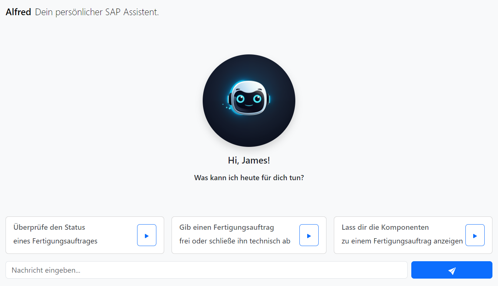

# Entwicklung und Evaluation eines KI-gestützten Assistenten zur Interaktion mit SAP S/4HANA in der Produktionsplanung und -steuerung
In diesem Repository befinden sich alle Entwickelten Artefakte im Rahmen der Masterarbeit  
Ersteller: Felix Rüppel  
Matrikelnummer: 6857683  
Semester: SS/2021

## Installieren von Python, pip und NodeJS sowie NPM
Diese Pakete sind Grundvoraussetzung um die Pakete zu Testen. Für das Testen der Jupyter Notebooks wird VS Code empfohlen.
| Software | Version | Link |
|----------|---------|------|
| Python   | 3.11.8  | [https://www.python.org/downloads/](https://www.python.org/downloads/) |
| pip      | -       | [https://pip.pypa.io/en/stable/installation/](https://pip.pypa.io/en/stable/installation/) |
| NodeJS   | -       | [https://docs.npmjs.com/downloading-and-installing-node-js-and-npm](https://docs.npmjs.com/downloading-and-installing-node-js-and-npm) |
| npm      | -       | [https://docs.npmjs.com/downloading-and-installing-node-js-and-npm](https://docs.npmjs.com/downloading-and-installing-node-js-and-npm) |

## Abhängigkeiten vor einem Test installieren
Um die erforderlichen Python-Pakete zu installieren, die in der `requirements.txt` Datei aufgeführt sind, öffnen Sie bitte ein Terminal und und navigieren sie in das jeweilige Verzeichnis des Modells. Führen Sie darin den folgenden Befehl aus:

```bash
pip install -r requirements.txt
```

## Informationen zum Testen mit den entwickelten Modellen
Mögliche Fragen zum Testen der NER oder Klassifikation der Datei ```conversations_2024_single.json``` entnehmen, siehe Schlüssel ```prompt```. Das ist der ein-eindeutige Datensatz, welcher für das Training maschinell repliziert wurde. Für das Training wurden folgende Nummernkreise berücksichtigt.

```bash
plant_list = ["0001", "1010", "YS10", "YS15", "YS20", "YS25", "YS50"]
product_list = ["SG124", "SG224", "FG226", "FG228", "FG113", "RM142", "RM143", "RM234", "RM124"]

number_ranges = {
    "ManufacturingOrder": {
        "from": 1000000,
        "to": 1999999
    },
    "OrderId": {
        "from": 1000000,
        "to": 1999999
    },
    "ConfirmationGroup": {
        "from": 1000,
        "to": 9999
    },
    "ConfirmationCount": {
         "from": 1,
        "to": 1000
    },
    "Operation": {
         "from": 1,
        "to": 1000
    }
}
```

Ein Beispielhafter prompt könnte dann wie folgt aussehen
```bash
USER_PROMPT = "Gib die Mindest- und Höchstbestände für Produkt SG224 im Werk 1010 an."
```

### Testen der Named Entity Recognition (NER)
Das dazugehörige Jupyter Notebook befindet sich im Ordner ```Named_Entitity_Recognition_NER```. Bitte die requirements.txt vor dem Test installieren.

### Testen der Klassifikationsergebnisse
Das RF- und NN Modell befindet sich im jeweiligen Ordner. Darin befindet sich ein Jupyter Notebook, mit dem die Klassifikation der API-Parameter getestet werden kann. Bitte die requirements.txt vor dem Test installieren.

## ChatbotConnectivityKit
Das Backend des Chatbot ist nicht ausführbar, da die .env Datei nicht mit hochgeladen wurde. Darin befinden sich sensitive Zugangsdaten für das SAP sowie die LLM. Der Vollständigkeit wurden die Dateien jedoch hochgeladen. Das Hauptmodul ist ```api.py```, welches das Module load_models lädt. Dieses lädt die entwickelten RF/NN-Modelle, ausgehend von der Konfiguration der Umgebungsvariablen. Das Modul ```model_inference.py``` beinhaltet die Klasse und Funktionen, um die Vorhersage durchzuführen und diese in Klartext aufzubereiten und den API-Request zum SAP System durchzuführen. ```config.py``` sorgt für die Zuweisung der Werte innerhalb der .env Datei.

## Ausführen des Chatbot UI (React Web App)
Hierzu bitte in das Projektverzeichnis alfred-react navigieren. Darin zunächst

```bash 
npm install
``` 
ausführen. Dadurch werden alle Abhängigen Pakete für React geladen. Danach mit 

```bash 
npm start
``` 

die Web App starten. Dann werden alle Dependencies geladen und können ausgeführt werden. Bitte beachten, dass NodeJS und npm zuvor installiert werden müssen. <br><br>


Bitte beachten, dass das Backend (ChatbotConnectivityKit) nicht an das SAP System außerhalb des Unternehmensnetzwerkes angebunden ist. Das Absenden einer Nachricht wird eine Fehlermeldung zurückliefern.
